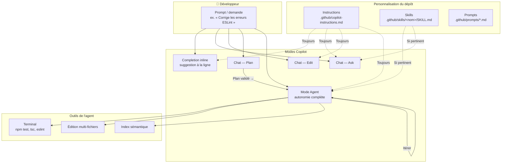

# Développer en TypeScript avec GitHub Copilot

Formation GitHub Copilot pour le développement TypeScript : des **completions inline** au **mode Agent**, via la personnalisation (**Instructions**, **Skills**).

| Module | Thème |
| ------ | ----- |
| 1 | Introduction |
| 2 | Completions inline |
| 3 | Chat et modes |
| 4 | Agent, Skills, Instructions + schéma |
| 5 | Path-specific, skills avancés, commit, review |
| 6 | Bonnes pratiques |

---

## Module 1 : Introduction à GitHub Copilot

### Qu'est-ce que GitHub Copilot ?

GitHub Copilot est un assistant de programmation basé sur l'intelligence artificielle, développé par GitHub en collaboration avec OpenAI. Il fonctionne comme un **pair-programmer virtuel** intégré directement dans l'éditeur de code.

**Principe de fonctionnement :**

- Copilot analyse le contexte du code en cours d'écriture (fichiers ouverts, commentaires, noms de variables)
- Il génère des suggestions de code en temps réel, directement dans l'éditeur
- Le modèle sous-jacent a été entraîné sur des milliards de lignes de code provenant de dépôts publics GitHub
- Il est particulièrement efficace en TypeScript grâce à l'écosystème massif open source (React, Node.js, NestJS, Deno, etc.)

**Ce que Copilot n'est pas :**

- Ce n'est pas le compilateur TypeScript (`tsc`) ni ESLint
- Il ne garantit pas que le code généré est correct ou sécurisé
- Il ne remplace pas la compréhension de TypeScript et du typage statique

### Les différentes versions — du complétion à l'agent

GitHub Copilot propose plusieurs **niveaux d'autonomie**. La formation s'articule autour du mode **Agent** et de sa personnalisation (**Instructions**, **Skills**), tout en conservant les **completions inline** pour l'écriture au fil de l'eau.

| Version              | Niveau d'autonomie | Description                                    | Usage principal                         |
| -------------------- | ------------------ | ---------------------------------------------- | --------------------------------------- |
| **Copilot (inline)** | Faible             | Suggestions de code directement dans l'éditeur | Complétion au quotidien, boilerplate    |
| **Copilot Chat**     | Moyen              | Conversation (Ask, Edit, Plan)                 | Questions, explications, refactoring    |
| **Mode Agent**       | Élevé              | Planifie, modifie plusieurs fichiers, exécute  | Tâches multi-fichiers, debug, migration |
| **Copilot CLI**      | Élevé              | Agent en ligne de commande                     | Shell, tests, CI, scripts               |

**Copilot inline** reste le point d'entrée : dès qu'on tape du code, des suggestions apparaissent en gris (`Tab` pour accepter). Voir le **Module 2**.

**Copilot Chat** couvre Ask, Edit, Plan et Agent. Voir le **Module 3**.

**Instructions, Skills et mode Agent** : voir les **Modules 4 et 5**.

**Copilot CLI** (`gh copilot`) reprend la logique agentique hors de l'éditeur — utile pour lancer les tests (`npm test`), typer (`tsc --noEmit`) ou formater le code.

> **Fil conducteur :** maîtriser les completions inline, puis le Chat, puis personnaliser le projet avec Instructions et Skills pour le mode Agent.

### Installation et configuration

**Prérequis :**

- Un compte GitHub avec un abonnement Copilot actif (Individual, Business ou Enterprise)
- Visual Studio Code installé
- Extension **TypeScript and JavaScript** de Microsoft (IntelliSense) + **ESLint** recommandé

**Étapes d'installation :**

1. Ouvrir VS Code
2. Aller dans Extensions (`Ctrl + Shift + X`)
3. Rechercher "GitHub Copilot" et installer l'extension
4. Installer également "GitHub Copilot Chat"
5. Se connecter à GitHub quand VS Code le demande
6. Vérifier l'icône Copilot dans la barre de statut (en bas)

**Vérification du fonctionnement :**
Créer un fichier `test.ts` et commencer à taper :

```typescript
// Fonction qui affiche Hello World
function greet(name: string): string {
```

Si Copilot fonctionne, une suggestion devrait apparaître en gris pour compléter la fonction.

### Interface et statistiques d'utilisation

Pour consulter les statistiques d'utilisation de Copilot :

- Cliquer sur l'icône Copilot dans la barre de statut de VS Code
- Accéder au tableau de bord via GitHub : `Settings > Copilot > Usage`
- Les métriques disponibles : taux d'acceptation des suggestions, lignes de code générées, langages les plus utilisés

En entreprise (Copilot Business/Enterprise), les administrateurs ont accès à un dashboard détaillé montrant le pourcentage d'utilisation par équipe et par développeur.

---

## Module 2 : Completions inline et contexte

Les **completions inline** sont le mode le plus utilisé au quotidien. Une fois les **Instructions** configurées (Module 4), elles produisent des suggestions alignées sur les standards du projet TypeScript.

### Raccourcis clavier essentiels

| Action                           | Raccourci (Windows/Linux) | Raccourci (Mac) |
| -------------------------------- | ------------------------- | --------------- |
| Accepter la suggestion           | `Tab`                     | `Tab`           |
| Rejeter la suggestion            | `Échap`                   | `Échap`         |
| Suggestion suivante              | `Alt + ]`                 | `Option + ]`    |
| Suggestion précédente            | `Alt + [`                 | `Option + [`    |
| Accepter le mot suivant          | `Ctrl + →`                | `Cmd + →`       |
| Déclencher manuellement          | `Alt + \`                 | `Option + \`    |
| Ouvrir le panneau de suggestions | `Ctrl + Enter`            | `Ctrl + Enter`  |

Le panneau de suggestions (`Ctrl + Enter`) ouvre une fenêtre avec jusqu'à 10 suggestions alternatives. Utile quand la première suggestion ne convient pas.

### Déclencher des suggestions

#### Commencer à taper une signature de fonction

```typescript
function calculateFactorial(n: number): number
```

Copilot va proposer le corps de la fonction en se basant sur le nom explicite et les types.

#### Écrire un commentaire descriptif

```typescript
/** Tri à bulles sur un tableau de nombres, retourne une copie triée */
function bubbleSort(arr: number[]): number[]
```

Le commentaire guide Copilot sur l'algorithme attendu.

#### Créer une structure de données

```typescript
interface Employee {
  name: string;
  age: number;
  salary: number;
}
```

Copilot pourra suggérer des fonctions cohérentes (createEmployee, formatEmployee, etc.).

#### Nommer une variable de manière explicite

```typescript
const maxRetryCount = 3;
let errorMessage: string | null = null;
const inputStream = createReadStream("data.csv");
```

Des noms de variables clairs aident Copilot à comprendre l'intention du code.

### Le contexte compte

Copilot ne se base pas uniquement sur la ligne en cours. Il analyse un **contexte élargi** :

**Les fichiers ouverts dans l'éditeur :**
Si vous avez `utils.types.ts` ouvert avec des interfaces, Copilot les utilisera pour générer des implémentations cohérentes dans `utils.ts`.

**Les imports influencent les suggestions :**

```typescript
import { Router } from "express";     // Copilot suggère des routes REST
import React, { useState } from "react"; // Copilot suggère des composants/hooks
import { z } from "zod";              // Copilot suggère des schémas de validation
```

**Le code environnant guide la génération :**
Si les fonctions précédentes utilisent un style particulier (gestion d'erreurs, patterns async, immutabilité), Copilot va reproduire ce pattern.

```typescript
// Si votre code existant fait ceci :
const result = await fetch(url);
if (!result.ok) {
  throw new ApiError(result.status, await result.text());
}

// Copilot reproduira ce pattern de gestion d'erreur HTTP
```

### La fenêtre de contexte (context window)

La **fenêtre de contexte** (ou _context window_) est la quantité maximale de texte — code, commentaires, historique de chat, instructions du projet — que le modèle peut prendre en compte **en une seule requête**.

**Définition concrète :**

- Tout ce que Copilot « voit » avant de répondre occupe cette fenêtre : fichiers ouverts, sélection, messages du chat, `@workspace`, instructions Copilot, etc.
- Cette limite se mesure en **tokens** (morceaux de texte), pas en lignes de code.
- Au-delà de la limite, le contenu le plus ancien ou le moins prioritaire est **tronqué**.

**Pourquoi c'est important :**

| Conséquence                       | Explication |
| --------------------------------- | ----------- |
| **Perte de contexte**             | Un gros fichier + historique chat peuvent faire « oublier » le début. |
| **Suggestions moins cohérentes**  | Si vos conventions ne tiennent plus dans la fenêtre, Copilot revient à des patterns génériques. |
| **Réponses incomplètes en Agent** | Sur un gros dépôt, l'agent doit cibler les bons fichiers. |
| **Coût de qualité du prompt**     | Un contexte pertinent vaut mieux qu'un contexte volumineux. |

**Bonnes pratiques pour optimiser la fenêtre :**

- Garder ouverts uniquement les fichiers **pertinents** (ex. `utils.types.ts` + `utils.ts`, pas tout le projet).
- Poser des questions **ciblées** dans le chat plutôt que de coller des milliers de lignes.
- Utiliser `#file:src/services/parser.ts` pour un fichier précis plutôt que `#workspace` quand la question est locale.
- Découper les grosses refontes en étapes (module par module).
- Centraliser les règles du projet dans les **Instructions** (voir Module 4).

### L'art du commentaire-prompt

En TypeScript, les commentaires JSDoc et les signatures typées guident Copilot.

**Commentaire vague → résultat imprécis :**

```typescript
// trier le tableau
```

**Commentaire précis → résultat ciblé :**

```typescript
/**
 * Tri par insertion sur un tableau de nombres en ordre croissant.
 * Complexité O(n²) pire cas. Ne mute pas l'argument — retourne une copie.
 */
function insertionSort(arr: number[]): number[]
```

### Principes de base

**Être spécifique et précis :**

```typescript
// ❌ Vague
// lire un fichier

// ✅ Précis
/** Lit un fichier texte ligne par ligne. Retourne un tableau de lignes. Lance une erreur si le fichier est introuvable. */
async function readLines(filePath: string): Promise<string[]>
```

**Donner du contexte :**

```typescript
// Cette fonction fait partie du service de cache Redis
// Récupère une clé avec TTL, retourne null si expirée ou absente
async function getCached<T>(key: string): Promise<T | null>
```

**Décomposer les problèmes complexes :**

```typescript
// Étape 1 : Parser une ligne CSV en tokens
function parseCsvLine(line: string): string[];

// Étape 2 : Convertir les tokens en Employee
function tokenToEmployee(tokens: string[]): Employee;

// Étape 3 : Insérer dans le tableau avec immutabilité
function insertEmployee(employees: Employee[], emp: Employee): Employee[];
```

**Itérer sur les suggestions :**
Si la première suggestion ne convient pas, utiliser `Alt + ]` pour voir les alternatives, ou reformuler le commentaire.

### Structure d'un bon prompt

Un prompt efficace suit la structure **Quoi / Comment / Contraintes** :

```typescript
/**
 * QUOI : Recherche un élément dans un tableau trié
 * COMMENT : Recherche dichotomique (binary search)
 * CONTRAINTES :
 *   - Tableau trié croissant
 *   - Retourne l'index ou -1
 */
function binarySearch(arr: readonly number[], target: number): number
```

Autre exemple :

```typescript
/**
 * QUOI : Clone profond d'un arbre binaire typé
 * COMMENT : Parcours récursif avec spread immuable
 * CONTRAINTES :
 *   - Retourne null si la racine est null
 *   - Préserver le typage générique TreeNode<T>
 */
function deepCopyTree<T>(root: TreeNode<T> | null): TreeNode<T> | null
```

### Itération et raffinement

**Accepter partiellement une suggestion :**
Utiliser `Ctrl + →` (accepter mot par mot) quand le début de la suggestion est bon mais la suite diverge.

**Modifier et relancer pour affiner :**

```typescript
// Premier essai — bubble sort basique
// Trier un tableau

// Deuxième essai — plus précis
/** Quicksort avec pivot médian, Lomuto, fallback insertion sort si length < 10 */
function quicksort(arr: number[]): number[]
```

**Combiner plusieurs suggestions :**
Accepter une suggestion pour le squelette, puis supprimer certaines parties et redemander avec un commentaire plus spécifique.

---

## Module 3 : Chat et modes d'interaction

### Les modes du Chat — Ask, Edit, Plan, Agent

Copilot Chat propose plusieurs **modes** selon le niveau d'autonomie souhaité. Ils partagent les **Instructions** du projet ; seuls **Agent** et partiellement **Ask** exploitent les **Skills** (voir Module 4).

| Mode       | Autonomie | Comportement                                      | Exemple en TypeScript                          |
| ---------- | --------- | ------------------------------------------------- | ------------------------------------------------- |
| **Ask**    | Faible    | Répond, explique, ne modifie pas les fichiers     | « Explique ce hook useEffect et ses dépendances »           |
| **Edit**   | Moyenne   | Modifie le code sélectionné ou le fichier actif | « Ajoute le typage strict sur ce paramètre any »     |
| **Plan**   | Moyenne   | Produit un plan détaillé avant d'agir             | « Plan pour migrer ce module CommonJS vers ESM »  |
| **Agent**  | Élevée    | Planifie, édite, exécute, itère                  | « Corrige toutes les erreurs ESLint sur src/ »    |

**Ask** — comprendre du code sans modification :

- Sélectionner un bloc, poser une question : « Pourquoi cette Promise ne se résout jamais ? »
- Les Instructions s'appliquent (ex. réponse alignée sur vos conventions JSDoc / TSDoc)

**Edit** — changements localisés :

- Sélectionner une fonction, demander « /fix » ou une modification ciblée
- Plus rapide que l'Agent pour une modification ponctuelle

**Plan** — grosses tâches :

- Copilot produit un plan numéroté ; vous validez avant passage en Agent

**Agent** — cœur de l'approche agentique (voir Module 4) :

- Accès terminal, multi-fichiers, index sémantique
- Active automatiquement les **Skills** pertinents

### Interface conversationnelle

Ouvrir le panneau Chat : `Ctrl + Shift + I` (ou `Cmd + Shift + I` sur Mac).

**Exemples de questions utiles en TypeScript :**

- "Explique-moi ce composant React et son cycle de vie"
- "Pourquoi TypeScript infère `never` ici ?"
- "Comment implémenter un middleware Express typé ?"
- "Génère les tests Vitest pour cette fonction"
- "Optimise ce rendu React pour éviter les re-renders inutiles"

**Obtenir des explications détaillées :**
Sélectionner un bloc de code complexe puis demander dans le chat :
"Explique ce code étape par étape, en particulier la gestion async/await et les types"

### Commandes slash

| Commande   | Action                                              |
| ---------- | --------------------------------------------------- |
| `/explain` | Explique le code sélectionné                        |
| `/fix`     | Propose une correction pour le code sélectionné     |
| `/tests`   | Génère des tests pour le code sélectionné           |
| `/doc`     | Génère la documentation (JSDoc / TSDoc) |
| `/new`     | Crée un nouveau fichier/projet                      |
| `/clear`   | Efface l'historique du chat                         |

**Exemple avec `/doc` :**

```typescript
function addNode(list: LinkedList, data: unknown): number;
```

```typescript
/**
 * Ajoute un nœud en tête de la liste chaînée.
 * @param list - Liste cible
 * @param data - Données à stocker
 * @returns L'index du nœud créé, ou -1 en cas d'erreur
 */
function addNode(list: LinkedList, data: unknown): number;
```

### Sélection de contexte

Surligner un bloc de code, puis ouvrir le chat → Copilot comprend que la question porte sur ce code précis.

### Indexation sémantique du codebase

L'**indexation sémantique** permet à Copilot de **comprendre le sens** du code du projet, pas seulement de faire correspondre des mots-clés.

**Principe :**

- Le dépôt est analysé en embeddings : fonctions, types, commentaires, relations entre fichiers.
- Une question du type « Où est gérée la validation ? » ou `@workspace trouve les handlers dupliqués` s'appuie sur cette index.
- Les résultats pertinents sont injectés dans la fenêtre de contexte.

| Approche                          | Limite |
| --------------------------------- | ------ |
| Fichiers ouverts + ligne courante | Ne couvre que ce que vous avez sous les yeux |
| Recherche par nom de symbole      | Rate les implémentations sous un autre nom |
| **Index sémantique**              | Retrouve du code par **intention** (« validation Zod », « middleware auth », « gestion d'erreur API ») |

**Bonnes pratiques :**

- Laisser l'indexation se terminer après un clone ou un gros pull.
- Formuler des requêtes avec des **concepts** (« hook React », « parsing CSV », « repository pattern »).
- Combiner index sémantique + `#file:src/services/parser.ts`.

### Mode Agent en pratique

Le **mode Agent** est le point d'application des **Skills** et **Instructions** configurés au Module 4.

Copilot peut :

- Exécuter des commandes terminal (`npm test`, `tsc --noEmit`, `eslint`, `vitest`)
- Modifier plusieurs fichiers en séquence
- Itérer jusqu'à résoudre un problème ou signaler un blocage

```
Mode Agent : « Corrige toutes les erreurs TypeScript et ESLint sur src/ »
→ Copilot active le skill lint-and-typecheck (si présent)
→ Applique les Instructions (strict, pas de any)
→ Lance tsc et eslint, corrige les fichiers, relance les tests
```

**Bonnes pratiques Agent :**

- Formuler un **objectif mesurable** (« 0 erreur tsc et eslint sur src/ »)
- Laisser l'indexation sémantique se terminer sur les gros dépôts
- Vérifier manuellement le diff avant commit

### Mode Cloud (aperçu)

Le mode Cloud permet d'exécuter des tâches Copilot sur l'infrastructure GitHub :

- Tâches longues en arrière-plan
- Pas besoin de garder VS Code ouvert
- Résultats via notification ou PR
- Utile pour des refactorings massifs ou des migrations

---

## Module 4 : Architecture agentique — Agent, Skills, Instructions

Après les completions inline (Module 2) et le Chat (Module 3), ce module détaille la **personnalisation agentique** : Instructions, Skills et mode Agent.

### Vue d'ensemble

| Concept          | Rôle                                      | Quand c'est actif                          | Fichier typique                          |
| ---------------- | ----------------------------------------- | ------------------------------------------ | ---------------------------------------- |
| **Instructions** | Règles permanentes du projet              | **Toujours** (inline, chat, agent)         | `.github/copilot-instructions.md`        |
| **Skill**        | Workflow spécialisé, chargé à la demande  | Quand la tâche correspond à la description | `.github/skills/<nom>/SKILL.md`          |
| **Agent**        | Mode autonome qui planifie et exécute     | Sur demande explicite (mode Agent)         | Interface Chat ou Copilot CLI            |

Les **Instructions** définissent _comment coder dans ce dépôt_. Les **Skills** enseignent _comment accomplir une tâche répétitive_. L'**Agent** _orchestre_ le tout.

### Qu'est-ce qu'un Agent ?

Un **agent** Copilot est un assistant **autonome** capable de :

- **Planifier** une tâche en plusieurs étapes
- **Lire et modifier** plusieurs fichiers du projet
- **Exécuter des commandes** dans le terminal
- **Itérer** jusqu'à un résultat satisfaisant

Contrairement à la **completion inline** ou au mode **Ask**, l'agent **agit** sur le dépôt.

**Exemple concret en TypeScript :**

```
Mode Agent : « Corrige toutes les erreurs TypeScript strict sur ce monorepo »
→ Lance tsc --noEmit sur chaque package
→ Analyse les diagnostics (fichier:ligne)
→ Corrige les types et imports
→ Relance les tests Vitest
```

### Qu'est-ce qu'une Instruction ?

Les **Instructions** sont des consignes **permanentes** injectées à **chaque** interaction.

Elles répondent à : _« Quelles sont les règles de ce projet TypeScript ? »_

| Fichier                              | Portée                                              |
| ------------------------------------ | --------------------------------------------------- |
| `.github/copilot-instructions.md`    | Global — tout le dépôt                              |
| `.github/instructions/*.md`          | Par chemin (applyTo: "src/**/*.ts")                |
| Instructions utilisateur (paramètres)| Tous vos projets                                    |

**Exemple pour un projet TypeScript :**

```markdown
# Instructions pour ce projet TypeScript

- TypeScript strict (`strict: true`), interdire `any` sauf commentaire `@reason`
- camelCase pour variables/fonctions, PascalCase pour types et composants React
- Préférer `async/await` aux Promises chaînées avec `.then()`
- Documenter l'API publique avec JSDoc (@param, @returns)
- Gestion d'erreurs : classes d'erreur typées ou Result<T, E>, pas de throw nu sans contexte
- Exécuter mentalement `tsc --noEmit` avant de suggérer du code
```

**Quand utiliser les Instructions :**

- Conventions de nommage et style
- strict mode, conventions React, règles ESLint du projet
- Consignes pédagogiques (ne pas compléter les TODO des exercices)

> Les Instructions restent **courtes et générales**. Pour un workflow détaillé, préférer un **Skill**.

### Qu'est-ce qu'un Skill ?

Un **Skill** est un dossier avec `SKILL.md` et, optionnellement, scripts et références. Copilot le **charge quand la tâche correspond** à la description.

**Structure :**

```
.github/skills/
└── lint-and-typecheck/
    ├── SKILL.md
    ├── scripts/
    │   └── run_checks.sh
    └── references/
        └── patterns.md
```

**Exemple de `SKILL.md` :**

```markdown
---
name: lint-and-typecheck
description: Vérifie le typage strict et ESLint sur un projet TypeScript. Utiliser quand l'utilisateur mentionne tsc, ESLint, type error, lint ou strict mode.
---

## Workflow

1. Identifier les scripts du projet (`npm run lint`, `npm run typecheck`)
2. Exécuter `tsc --noEmit` puis `eslint src/`
3. Pour chaque erreur : localiser fichier:ligne, corriger types/imports
4. Relancer les tests (`npm test` ou `vitest run`)
5. Itérer jusqu'à 0 erreur tsc et eslint

## Patterns fréquents

- Usage implicite de `any` ou cast `as unknown as`
- Imports manquants ou types incorrects sur les props React
- Promises non awaitées dans les handlers async
```

**Instructions vs Skill :**

|                    | Instructions                         | Skill                                      |
| ------------------ | ------------------------------------ | ------------------------------------------ |
| **Contenu**        | Règles courtes, standards du projet  | Workflow détaillé, scripts, références     |
| **Activation**     | Toujours                               | Seulement si la tâche est pertinente       |
| **Exemple**        | « strict: true, pas de any »         | « Procédure complète lint + typecheck + tests »    |

### Schéma explicatif — comment tout s'articule



**Lecture du schéma :**

1. **Instructions** : toujours présentes — standards strict, camelCase, pas de any.
2. **Skills** : chargés **à la demande**.
3. **Agent** : terminal + éditions + itérations.
4. **Completion inline** : rapide, localisée ; bénéficie des Instructions.

### Mise en place minimale pour un projet TypeScript

**Étape 1 — Instructions globales** (`.github/copilot-instructions.md`)

**Étape 2 — Instructions par chemin** (`.github/instructions/tests.md` avec `applyTo: "**/*.spec.ts,**/*.test.ts"`) : Adapter aux tests (Vitest/Jest, pas de mock excessif).

**Étape 3 — Un skill métier** (`.github/skills/lint-and-typecheck/SKILL.md`)

**Étape 4 — Tester en mode Agent** :

```
@workspace Corrige les erreurs TypeScript strict et ESLint sur src/
```

### Prompts réutilisables (complément)

```markdown
<!-- .github/prompts/new-module.prompt.md -->

Crée un nouveau module TypeScript avec :

- Un fichier `index.ts` exportant l'API publique
- Types/interfaces dans `types.ts`
- Tests Vitest dans `__tests__/`
- JSDoc sur chaque export public
```

---

## Module 5 : Path-specific, skills avancés, commit, review

Les concepts **Agent**, **Skill** et **Instruction** sont détaillés au **Module 4**.

### Instructions spécifiques par chemin (path-specific)

Les instructions **path-specific** ne s'activent que lorsque Copilot travaille sur des fichiers correspondant à un **glob**.

**Pourquoi les utiliser :**

- Le front React (`src/components/`) n'a pas les mêmes règles qu'une API Node (`src/api/`)
- Les tests (`*.spec.ts`) peuvent autoriser des mocks interdits en production
- Les fichiers `.tsx` vs `.ts` peuvent demander des conventions distinctes

**Organisation recommandée :**

```markdown
---
applyTo: "src/**/*.ts,src/**/*.tsx"
---

# Règles pour le code source TypeScript

- strict mode, pas de `any`
- Préférer les types inférés sauf API publique
- Composants React : PascalCase, props typées avec interface dédiée
```

```markdown
---
applyTo: "**/*.spec.ts,**/*.test.ts"
---

# Règles pour les tests

- Vitest ou Jest selon le projet existant
- Utiliser describe/it et les helpers du projet
- Mocker uniquement les dépendances externes, pas la logique testée
```

```markdown
---
applyTo: "exercices/**/*.ts"
---

# Contexte pédagogique — exercices étudiants

- Laisser les blocs TODO intacts
- Suggérer des indices en commentaire plutôt que des solutions complètes
- Respecter les signatures imposées par l'énoncé
```

**Ordre de priorité :**

1. Instructions globales
2. Instructions path-specific (glob correspondant)
3. Contexte immédiat (fichier, sélection, commentaire-prompt)

**Bonnes pratiques :**

- Préférer des globs **étroits** (`src/api/*.ts`) à `**/*`
- Documenter _pourquoi_ chaque règle existe
- Vérifier qu'une consigne globale n'annule pas une consigne locale

**Créer des Skills avancés :**

- Scripts dans `scripts/` (wrapper `npm run lint` avec options du projet)
- Doc lourde dans `references/` pour préserver la fenêtre de contexte
- Affiner la `description` YAML — **déclencheur** de sélection

### Prompts réutilisables (`.github/prompts/`)

```markdown
<!-- .github/prompts/new-module.prompt.md -->

Crée un nouveau module TypeScript avec :

- Un fichier `index.ts` exportant l'API publique
- Types/interfaces dans `types.ts`
- Tests Vitest dans `__tests__/`
- JSDoc sur chaque export public
```

### Commit automatique

- Cliquer sur l'icône Copilot dans Source Control
- Copilot analyse le diff et propose un message (Conventional Commits si configuré)

Exemple :

```
feat(parser): add CSV parsing with quoted field support

- Handle escaped quotes within fields
- Support multiline values enclosed in quotes
- Add error reporting with line numbers
```

### Code review sur les commits en cours

- Source Control → "Review Changes" avec Copilot
- Particulièrement utile en TypeScript pour détecter :

- Usages de `any` ou assertions de type dangereuses
- Promises non gérées (floating promises)
- Fuites mémoire côté Node (listeners, timers)
- XSS via `dangerouslySetInnerHTML` ou injection dans les templates

### Fine tuning et personnalisation

- Les **Instructions** (Module 4) influencent toutes les suggestions
- Les **Skills** standardisent les workflows répétitifs
- Copilot apprend des patterns du code existant dans le dépôt

---

## Module 6 : Bonnes pratiques et productivité

### Validation du code généré

Le code TypeScript généré par Copilot nécessite une vigilance particulière :

**Toujours vérifier :**

- Le typage (pas de `any` dissimulé, generics corrects)
- La gestion async (await, erreurs, race conditions)
- Les null/undefined (`strictNullChecks`)
- Les dépendances React (tableau de deps useEffect/useMemo)
- La sécurité (sanitisation entrées, secrets en dur)

**Outils de validation :**

```bash
# Vérification de types
npx tsc --noEmit

# Lint
npx eslint src/

# Tests
npm test
# ou
npx vitest run
```

### Quand utiliser Copilot

**Code répétitif ou boilerplate :**

```typescript
// Copilot excelle pour générer des fonctions CRUD similaires
function createEmployee(data: CreateEmployeeDto): Employee;
function updateEmployee(id: string, data: UpdateEmployeeDto): Employee;
function deleteEmployee(id: string): void;
function getEmployeeById(id: string): Promise<Employee | null>;
```

**Algorithmes classiques, tests, exploration d'APIs :**
Copilot connaît les implémentations standards et le boilerplate (React, Express, Zod, Prisma).

**Tests unitaires :**

```typescript
// Demander : "Génère les tests Vitest pour binarySearch"
describe("binarySearch", () => {
  it("finds existing element", () => {
    expect(binarySearch([1, 3, 5, 7, 9], 7)).toBe(3);
  });
  it("returns -1 when not found", () => {
    expect(binarySearch([1, 3, 5, 7, 9], 4)).toBe(-1);
  });
});
```

### Quand être prudent

**Code critique pour la sécurité :** toujours relire et tester en profondeur.

**Logique métier complexe :** Copilot peut produire du code syntaxiquement correct mais sémantiquement faux.

**Contraintes spécifiques :** SSR, edge runtime, bundles optimisés — Copilot ne connaît pas toujours les contraintes de déploiement.

**Performance critique :** Copilot génère du code fonctionnel mais rarement optimal. Pour des boucles critiques ou du rendu React lourd, l'expertise humaine reste indispensable.

### Productivité optimale

- Lire et comprendre chaque suggestion avant de l'accepter
- Copilot accélère l'écriture, il ne dispense pas de la réflexion
- Observer les suggestions pour découvrir des idiomes (découvrir `structuredClone`, `Array.at()`, les utility types (`Partial`, `Pick`) via les suggestions)

**Adapter son workflow progressivement :**

1. **Completions inline** — boilerplate (Module 2)
2. **Chat Ask/Edit** — debugging et documentation (Module 3)
3. **Instructions** — `.github/copilot-instructions.md` (Module 4)
4. **Skills** — workflow récurrent (Module 5)
5. **Mode Agent** — tâches multi-fichiers avec relecture du diff

---
